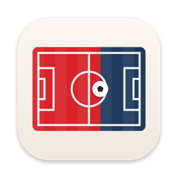

# Tussenstand

Een Mac-menubalk-app die in één blik laat zien hoe de wedstrijd van je club loopt: thuis · score · uit, met een balk die toont wie er drukt. Klik voor het verloop, de andere live wedstrijden en de live stand.

*A Mac menu bar app that shows at a glance how your club's match is going: home · score · away, with a bar showing who is on top. Click for the match flow, other live matches and the live table.*

Dit repo bevat alleen de releases. / *This repository only holds the releases.*

## Installeren

1. Download `Tussenstand.dmg` bij de laatste [release](../../releases/latest) en open hem.
2. Sleep **Tussenstand** naar **Programma's**.
3. Open **Terminal** en plak:

   ```bash
   bash /Volumes/Tussenstand/install.sh
   ```

   Dubbelklikken op `install.sh` werkt niet: macOS blokkeert het, omdat de app niet door Apple genotariseerd is. Het script haalt die blokkade weg en laat Tussenstand starten bij het inloggen.
4. Kies je club of land. De wedstrijd staat daarna in de menubalk.

Nieuwe versies installeer je daarna via het tandwiel in de app (Instellingen › Bijwerken).

## Installing

1. Download `Tussenstand.dmg` from the latest [release](../../releases/latest) and open it.
2. Drag **Tussenstand** to **Applications**.
3. Open **Terminal** and paste:

   ```bash
   bash /Volumes/Tussenstand/install.sh
   ```

   Double-clicking `install.sh` does not work: macOS blocks it because the app is not notarised by Apple. The script removes that block and starts Tussenstand at login.
4. Choose your club or country. The match then shows in the menu bar.

Later versions install from the gear in the app (Settings › Update).

## Vereisten / Requirements

macOS 15 Sequoia of nieuwer, Apple Silicon of Intel. / *macOS 15 Sequoia or later, Apple Silicon or Intel.*

Verwijderen kan via Instellingen › Verwijderen… / *Uninstall from Settings › Uninstall…*
